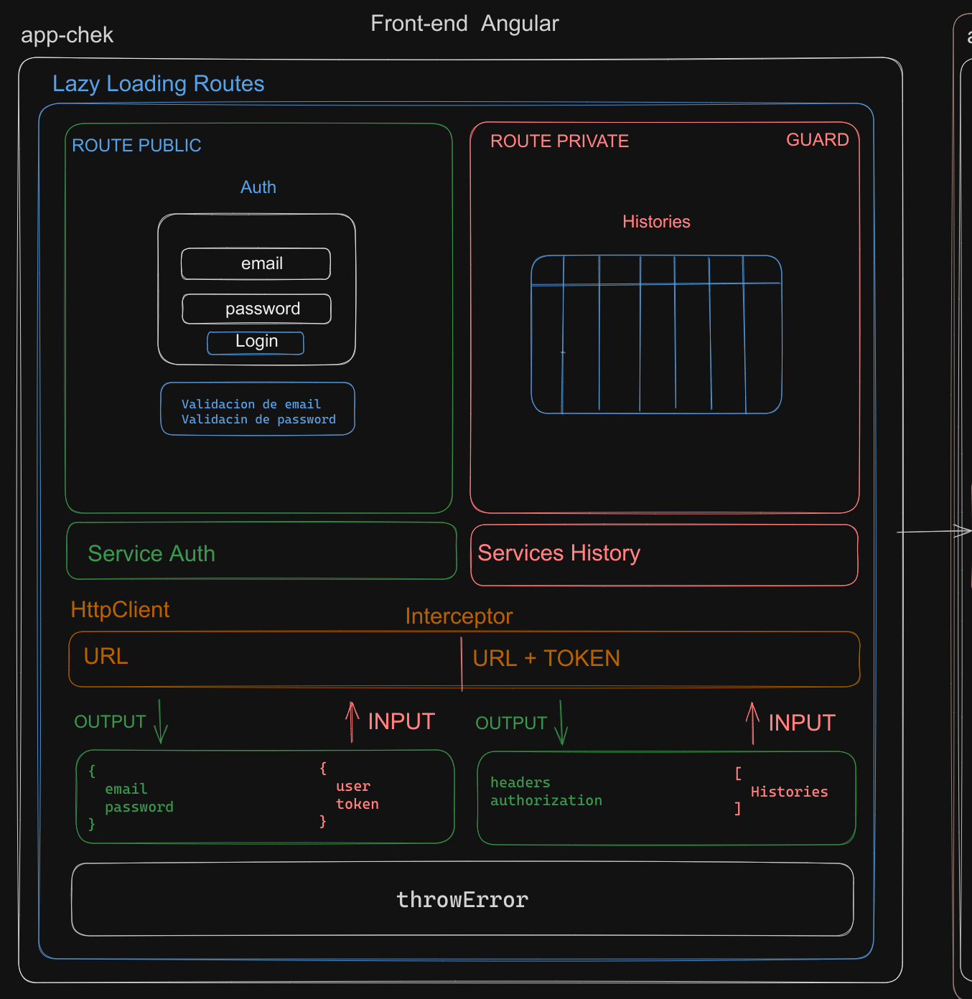

# Solution Chek

## Angular

## Modelo

App proccess model



## Test in Production:

Open [https://main.d1tdzrqq2m2s24.amplifyapp.com](https://main.d1tdzrqq2m2s24.amplifyapp.com).

## test User

```
user: denyslope@gimail.com
password: Febrero.19
```

## Execute local

1. Clone repository

2. Install dependences, execute:

```
yarn install
```

3. Excute mode developer

```
yarn start:dev
```

Runs the app in the development mode.
Open [http://localhost:4200](http://localhost:4200) to view it in the browser.
